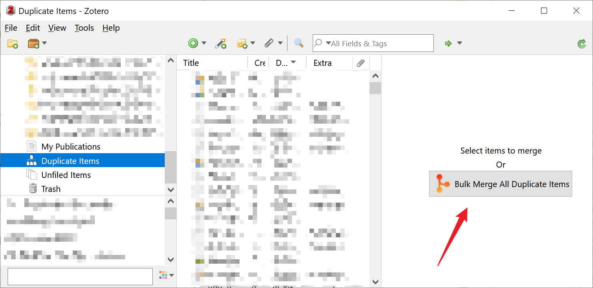
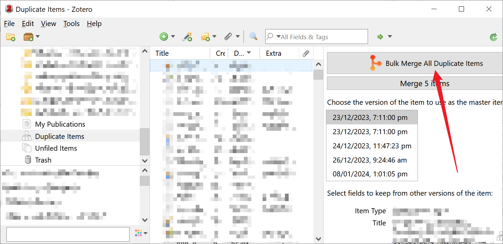
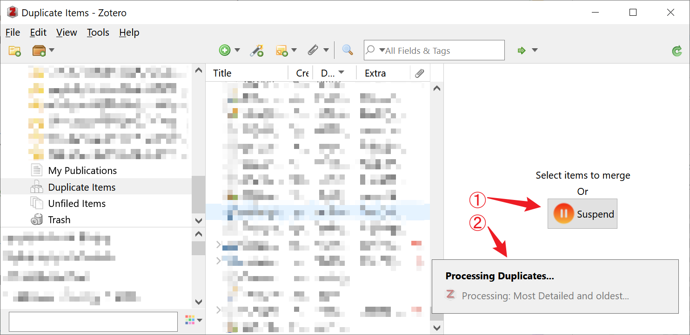

    

👉

👈

👉

👈

----

A plugin that does one thing only: **Detect** and **Manage** duplicate items in .

The plugin can detect if the newly imported item is a duplicate of an existing item in the library.
If so, it will prompt you to process the duplicate items.

The actions you can take are:

1. **Keep This**: Save the last imported item and delete the rest.
2. **Keep Others**: Delete the last imported item and save the rest.
3. **Keep All**: Keep both the new item and the existing item.
4. **Merge Manually**: Go to Duplicate Panel and merge the duplicate item manually.

Starting from **Version 2.0.0**, the plugin will support **Bulk Merge** functionality.

* **Bulk Merge**: Merge all duplicate items in the library automatically.

*If you find this project helpful, please consider [giving it a star](https://github.com/ChenglongMa/zoplicate)* ⭐. *It would be a great encouragement for me!*

> [!NOTE]
> We use the same method as Zotero to *detect* and *merge* duplicate items.
> 
> See [Zotero Documentation - Duplicate Detection](https://www.zotero.org/support/duplicate_detection) for more details.

# Changelog

## v2.1.0

In this version, we have made the following changes:

1. ✨ **NEW!**: We have added the **Suspend** and **Restore** functionality (Only available in Zotero 7 now).
   * Please see [Bulk Merge](#bulk-merge) section below for more details.
2. 🧬 **CHANGE!**: We have changed the behavior of **Keep Others** action.
   * Previously, the **Keep Others** action will delete the last imported item and save **ALL** the rest existing items.
   * Now, the action will **Merge** the existing items based on the **Master Item** preferences in [Settings](#settings).
3. 🐛 **FIX!**: We have fixed a bug that caused the **tags** could not be loaded correctly in v2.0.0.
   * Thanks [ChinJCheung](https://github.com/ChinJCheung) for reporting this bug in [issue #10](https://github.com/ChenglongMa/zoplicate/issues/10).

## v2.0.0

  
<i>Click here to show more.</i>

In this version, we have made the following changes:

1. ✨ **NEW!**: We have added the **Bulk Merge** functionality (Only available in Zotero 7 now).
   * **Bulk Merge**: Merge all duplicate items in the library automatically.
   * You can find the **Bulk Merge** button in the `Duplicate Items` panel.
   * Please see [Bulk Merge](#bulk-merge) section below for more details.
   * Thanks [csdaboluo](https://github.com/csdaboluo)'s idea mentioned in [issue #8](https://github.com/ChenglongMa/zoplicate/issues/8).
2. 🐛 **FIX!**: We have fixed a bug that caused the dialog height to be too high when importing duplicate items in bulk.
3. 🐛 **FIX!**: Now Zotero will auto-select the remained item after merging duplicate items.
   * Thanks [pencilheart](https://github.com/pencilheart)'s report in [issue #7](https://github.com/ChenglongMa/zoplicate/issues/7).

## v1.1.0

  
<i>Click here to show more.</i>

In this version, we have made the following changes:

1. 🧬 **CHANGE!**: We have changed the processing method of duplicate items.

   Previously, we use the `Trash` method to process duplicate items, i.e., delete the duplicate items.
   However, this method will cause the loss of some information of the duplicate items.
   * E.g., **notes**, **tags**, **collections**, **attachments**.

   In this version, we use the `Merge` method to process duplicate items.
   This method will copy all the aforementioned information to the retained item, and then delete the duplicate items.
   * **NOTE**: If you are using [ZotFile](http://zotfile.com/), the `Merge` method will copy the **file link** of the duplicate items to the retained item.
   * However, users relying on Zotero's default attachment storage may encounter duplication issues if the newly imported item contains attachments. 
     * This is a known potential problem in Zotero, as detailed in [Zotero Documentation - Duplicate Detection](https://www.zotero.org/support/duplicate_detection).

Thanks [ChinJCheung](https://github.com/ChinJCheung)'s idea mentioned in [issue #5](https://github.com/ChenglongMa/zoplicate/issues/5).

# Install

1. Download `.xpi` file according to the version of Zotero you are using.
   - **For Zotero 7**: Visit the [release page](https://github.com/ChenglongMa/zoplicate/releases/latest) and download [the latest `.xpi` file](https://github.com/ChenglongMa/zoplicate/releases/latest/download/zoplicate.xpi).
   - **For Zotero 6**: Visit the [release page](https://github.com/ChenglongMa/zoplicate/releases/tag/zotero6) and download [the `.xpi` file for Zotero 6](https://github.com/ChenglongMa/zoplicate/releases/download/zotero6/zoplicate.xpi).
   - If you are using FireFox, right-click on the link of the XPI file and select "Save As...".
2. Then, in Zotero, click `Tools` -> `Add-ons` and drag the `.xpi` onto the Add-ons window.
   See [how to install a Zotero addon](https://www.zotero.org/support/plugins).

# Usage

## Settings

In Zotero, click `Edit` -> `Settings`, go to `Zoplicate` tab, and you will see the settings.

1. You can select the actions you want to take when duplicate items are detected.
    * `Always Ask` is the default option if you have not changed the settings.
2. You can select the version of duplicate items to use as the **master item**.
    * `Earliest Added` is the default option if you have not changed the settings.

## Duplicate Detection

By default, or you have selected `Always Ask` in the settings,
a dialog will pop up when you import a new item that is a duplicate of an existing item.

The dialog will show the duplicate items and the actions you can take.

1. Select the action you want to take and click <kbd>Apply</kbd> to process the duplicate items.
2. Click <kbd>Go to Duplicates</kbd> to go to the `Duplicate Items` panel and merge the duplicate items manually.
3. Click <kbd>Cancel</kbd> to dismiss the dialog and **save** the import of the new item and the existing items.
4. Check <kbd>Use this action by default</kbd> to remember the selected action in default settings.
   Then the next time you import a duplicate item, the selected action will be applied automatically.

### Multiple Duplicate Items

When you import multiple duplicate items,
or import another duplicate item before you process the previous duplicate items,
the dialog will show all the duplicate items and the actions you can take.

1. You can select different actions for different duplicate items.
2. Click the _header_ of action columns to select the same action for all duplicate items.
3. <kbd>Use this action by default</kbd> option will be shown only when you select the same action for all duplicate items.

## Bulk Merge

Inspired by [csdaboluo](https://github.com/csdaboluo)'s idea and [ZoteroDuplicatesMerger](https://github.com/frangoud/ZoteroDuplicatesMerger),
we have added the **Bulk Merge** functionality in **Version 2.0.0**.

In the `Duplicate Items` panel, you can find the **Bulk Merge** button:

You can also find it when you select one or more duplicate items:

> [!WARNING]  
> 
> 1. Before clicking the button, please make sure you have properly configured the _Master Item_ preferences in [Settings](#settings).
> 2. The **Bulk Merge** functionality will **take a while** to complete if you have a large number of duplicate items.
> 3. This functionality is only available in Zotero 7 now. I will check compatibility and try to migrate to Zotero 6.

You will see the progress of the bulk merge process:

### Suspend Bulk Merge

You can click the <kbd>Suspend</kbd> button to suspend the bulk merge process.

A dialog will pop up to confirm your action:

1. Click <kbd>Resume</kbd> to **resume** the bulk merge process.
2. Click <kbd>Cancel</kbd> to **cancel** the bulk merge process.
   * Check <kbd>Restore Deleted Items</kbd> to restore the duplicate items that have been merged.
   * Note that the **Restore** action is only effective if you click <kbd>Cancel</kbd>. 

> [!TIP]
>
> If you want to **Restore** the duplicate items that have been merged, 
> you can go to `Trash` panel and restore them.
> 
> 1. Select the duplicate items you want to restore.
> 2. Click <kbd>Restore to Library</kbd> button to process.

# Contributing

👋 Welcome to **Zoplicate**! We're excited to have your contributions. Here's how you can get involved:

1. 💡 **Discuss New Ideas**: Have a creative idea or suggestion? Start a discussion in
   the [Discussions](https://github.com/ChenglongMa/zoplicate/discussions) tab to share your thoughts and
   gather feedback from the community.

2. ❓ **Ask Questions**: Got questions or need clarification on something in the repository? Feel free to open
   an [Issue](https://github.com/ChenglongMa/zoplicate/issues) labeled as a "question" or participate
   in [Discussions](https://github.com/ChenglongMa/zoplicate/discussions).

3. 🐛 **Issue a Bug**: If you've identified a bug or an issue with the code, please open a
   new [Issue](https://github.com/ChenglongMa/zoplicate/issues) with a clear description of the problem, steps
   to reproduce it, and your environment details.

4. ✨ **Introduce New Features**: Want to add a new feature or enhancement to the project? Fork the repository, create a
   new branch, and submit a [Pull Request](https://github.com/ChenglongMa/zoplicate/pulls) with your changes.
   Make sure to follow our contribution guidelines.

5. 💖 **Funding**: If you'd like to financially support the project, you can do so
   by [sponsoring the repository on GitHub](https://github.com/sponsors/ChenglongMa). Your contributions help us
   maintain and improve the project.

Thank you for considering contributing to **Zoplicate**. We value your input and look forward to collaborating
with you!

# Acknowledgements

The icons used in this project are from [Flaticon](https://www.flaticon.com/):
*  <a href="https://www.flaticon.com/free-icons/code-merge" title="code-merge icons">Code-merge icons created by Cap Cool - Flaticon</a>
*  <a href="https://www.flaticon.com/free-icons/ui" title="ui icons">Ui icons created by Cap Cool - Flaticon</a>
